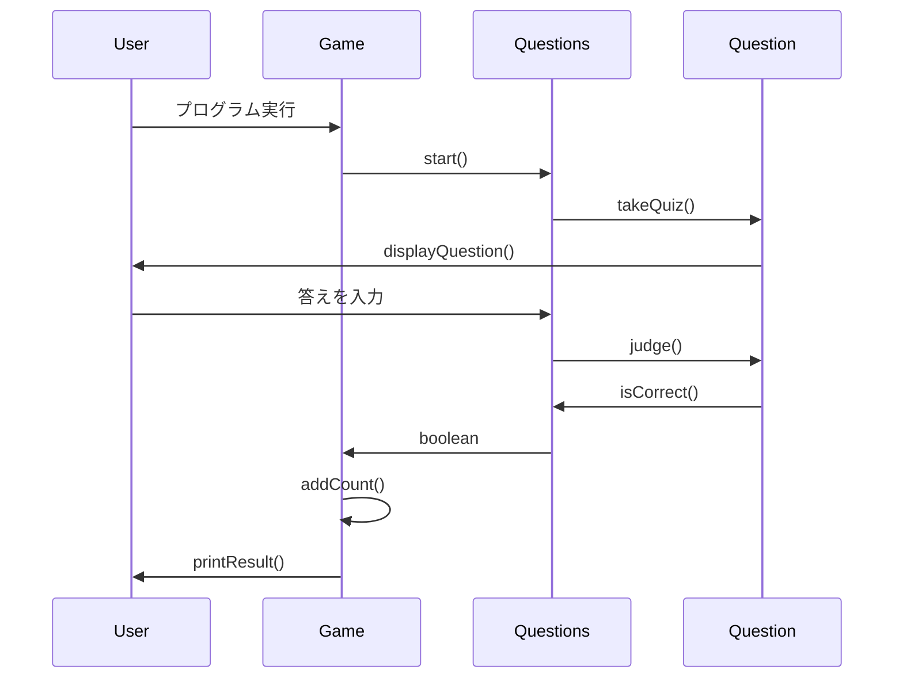

```mermaid
sequenceDiagram
    User ->> Game: プログラム実行
    Game ->> Questions: start()
    Questions ->> Question: takeQuiz()
    Question ->> User: displayQuestion()
    User ->> Questions : 答えを入力
    Questions ->> Question : judge()
    Question ->> Questions : isCorrect()
    Questions ->> Game: boolean
    Game ->> Game: addCount()
    Game ->> User: printResult()
```
